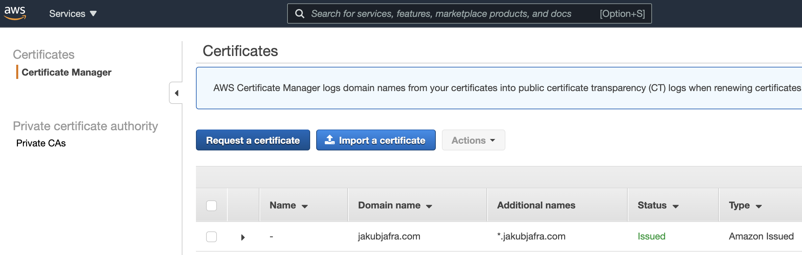
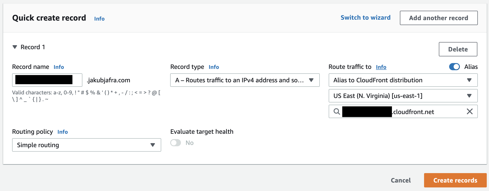
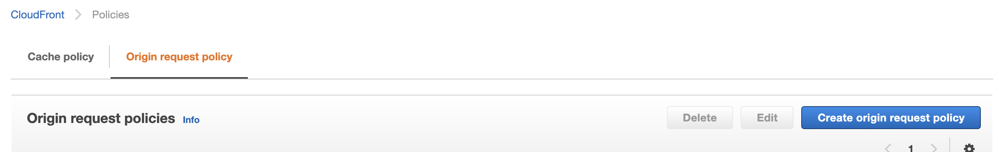
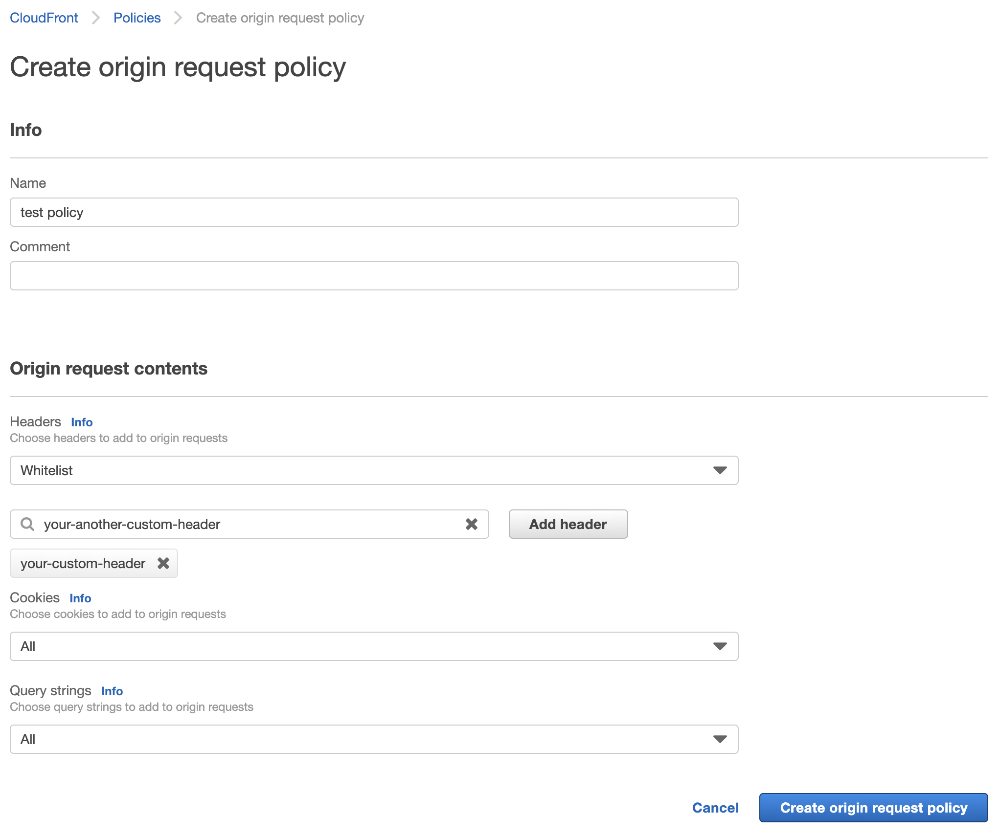

Deploying a static Gatsby site to CloudFront can be challenging. There is an excellent
`gatsby-plugin-s3` (which I'll be using) with a terrible documentation piece around deploying to
CloudFront. And when trying to add `serverless` in the mix, it took me quite some time to get it all
working.

I wanted to deploy my static site to AWS using serverless because:

- it enables reliable infrastructure management (no dangling resources, easy cleanup, nearly no
  manual work)
- to integrate with API layer on the same domain (a Lambda service, using API Gateway)
  - with the ability to run the API layer using `serverless-offline` plugin on the localhost
- have the hosting on the same provider as the rest of the infrastructure
- keep initial costs to the minimum

# Prerequisites

Install these required dependencies in your project:

```bash
npm install gatsby-plugin-s3 gatsby-plugin-canonical-urls
npm install --save-dev serverless serverless-s3-sync serverless-cloudfront-invalidate
```

`gatsby-plugin-canonical-urls` is a plugin to fix SEO after we make our S3 site publicly available,
as described in the `gatsby-plugin-s3`'s documentation
[here](https://gatsby-plugin-s3.jari.io/recipes/with-cloudfront).

`serverless-cloudfront-invalidate` is a plugin required for optimal CloudFront cache configuration,
again as described in the `gatsby-plugin-s3`'s documentation
[here](https://gatsby-plugin-s3.jari.io/recipes/with-cloudfront).

Then, in your `gatsby-config.js` add this configuration:

```js
// somewhere on the top of the file:
const siteAddress = new URL('https://your-site.address');

// to the plugins:
module.exports = {
  // your stuff...
  plugins: [
    // your plugins...
    {
      resolve: `gatsby-plugin-canonical-urls`,
      options: {
        siteUrl: siteAddress.href.slice(0, -1),
      },
    },
    {
      resolve: `gatsby-plugin-s3`,
      options: {
        bucketName: 'my-example-bucket',
        protocol: siteAddress.protocol.slice(0, -1),
        hostname: siteAddress.hostname,
      },
    },
  ],
};
```

You can also modify your `package.json` and add scripts for deployment:

```json
{
  "scripts": {
    "deploy-dev": "serverless deploy --force --stage=dev",
    "deploy-prod": "serverless deploy --force --stage=prod"
  }
}
```

# serverless.yml - without API Gateway, but with stages

A "basic" file that I ended up with can is here (put it in your's root folder):

```yml
service: your-service-name
unresolvedVariablesNotificationMode: error # future proofing
variablesResolutionMode: 20210219 # future proofing

plugins:
  - serverless-s3-sync
  - serverless-cloudfront-invalidate

provider:
  name: aws
  region: eu-west-1 # could be different!
  runtime: nodejs12.x
  stage: ${opt:stage}
  endpointType: REGIONAL
  memorySize: 128
  lambdaHashingVersion: 20201221 # future proofing
  apiGateway:
    shouldStartNameWithService: true # future proofing

# here most of your configuration will happen:
# I'm also using a trick to enable stages, see [C] below
custom:
  gatsbyPublicDir: ./public # a path to Gatsby's public folder
  gatsbyCacheDir: ./.cache # a path to Gatsby's .cache folder
  bucketNames: # bucket names for deployment, those need to be also your domain names
    localhost: dev.your-site.address # doesn't really matter
    dev: dev.your-site.address # in order to use subdomain, you have to have wildcard certificate
    prod: your-site.address # your production site address
  loggingBucketName: fitsearch-frontend-logs.s3.amazonaws.com # CloudFront's log's bucket name
  frontendBucketName: ${self:custom.bucketNames.${self:provider.stage}} # the bucket name is based on the stage
  domainCertificateArn: arn:aws:acm:us-east-1:298671596134:certificate/3a9c15fe-47ed-4475-a16d-38f9fb88b892 # your SSL cerificate for that domain, see [A] below
  # fix for local development:
  s3SyncParamsFileLocation:
    localhost: ./dummyS3Params.json
    dev: ${self:custom.gatsbyCacheDir}/s3.params.json
    prod: ${self:custom.gatsbyCacheDir}/s3.params.json
  s3RoutingRulesFileLocation:
    localhost: ./dummyS3Params.json
    dev: ${self:custom.gatsbyCacheDir}/s3.sls.routingRules.json
    prod: ${self:custom.gatsbyCacheDir}/s3.sls.routingRules.json
  # plugin's custom config:
  s3Sync:
    - bucketName: ${self:custom.frontendBucketName}
      localDir: ${self:custom.gatsbyPublicDir}
      deleteRemoved: true
      acl: public-read
      defaultContentType: text/html
      params: ${file(${self:custom.s3SyncParamsFileLocation.${self:provider.stage}})}
  cloudfrontInvalidate:
    - distributionIdKey: 'FrontendCloudFrontDistributionId'
      autoInvalidate: true
      items:
        - '/*'

resources:
  Resources:
    FrontendBucket: # this will create our bucket (gatsby-s3-plugin needs exsisiting bucket manually created)
      Type: AWS::S3::Bucket
      Properties:
        BucketName: ${self:custom.frontendBucketName}
        AccessControl: PublicRead
        WebsiteConfiguration:
          IndexDocument: index.html
          ErrorDocument: 404.html
          RoutingRules: ${file(${self:custom.s3RoutingRulesFileLocation.${self:provider.stage}})}
        CorsConfiguration:
          CorsRules:
            - AllowedMethods:
                - GET
              AllowedOrigins:
                - '*'
              AllowedHeaders:
                - 'Authorization'
                - 'Content-Length'
              MaxAge: 3000
    FrontendBucketPolicy: # the bucket also need a public access policy, since we'll use S3 bucket hosting
      Type: AWS::S3::BucketPolicy
      Properties:
        Bucket:
          Ref: FrontendBucket
        PolicyDocument:
          Statement:
            - Sid: 1
              Effect: Allow
              Principal: { AWS: '*' }
              Action:
                - s3:GetObject
              Resource: arn:aws:s3:::${self:custom.frontendBucketName}/*
    FrontendCloudFrontDistribution:
      Type: AWS::CloudFront::Distribution
      Properties:
        DistributionConfig:
          Origins:
            - DomainName: !Select [1, !Split ['//', !GetAtt FrontendBucket.WebsiteURL]]
              Id: FrontendCloudFrontS3Origin
              CustomOriginConfig:
                HTTPPort: 80
                HTTPSPort: 443
                OriginProtocolPolicy: http-only
          Enabled: 'true'
          PriceClass: 'PriceClass_100' # cheapest price class, for USA & EU regions
          HttpVersion: 'http2'
          Aliases:
            - ${self:custom.frontendBucketName} # the CloudFront is ready to be plugged in into Route 53, but it's not automatically added, see [B] below
          DefaultRootObject: index.html
          DefaultCacheBehavior:
            TargetOriginId: FrontendCloudFrontS3Origin
            # Caching Optimized (AWS managed cache policy)
            CachePolicyId: 658327ea-f89d-4fab-a63d-7e88639e58f6
            AllowedMethods:
              - GET
              - HEAD
            ForwardedValues:
              QueryString: 'false'
              Cookies:
                Forward: none
            ViewerProtocolPolicy: redirect-to-https
            Compress: 'true'
          ViewerCertificate:
            AcmCertificateArn: ${self:custom.domainCertificateArn}
            SslSupportMethod: sni-only
          Logging:
            IncludeCookies: 'false'
            Bucket: ${self:custom.loggingBucketName}
            Prefix: ${self:custom.frontendBucketName}
  Outputs:
    FrontendCloudFrontDistributionId:
      Value:
        Ref: FrontendCloudFrontDistribution
```

For `serverless-offline`'s compatibility, it's also needed to create a file called
`dummyS3Params.json` next to the `serverless.yml`. Fill it with just an empty object inside:

```json
{}
```

It acts as a placeholder for the plugins that need _something_ even they are not used when running
on localhost. If you indeed add `serverless-offline` plugin, rememeber to use `localhost` stage.

To deploy, just execute the script you've added recently:

```
npm run deploy-dev
```

#### A) Domain certificate

In order for this to work you need to manually create a domain certificate and put its ARN to the
custom config above. It's very easy to do via AWS console "Certificate Manager". If you want to use
a subdomain it's important to add the wildcard (`*.example.com`) to the certificate's domain - you
cannot do that later!

<div style="width: 100%; margin: auto;">
  
</div>

#### B) Adding the CloudFront to Route 53

If you are hosting your domain on Route 53, it's easy to add a deployed CloudFront via AWS console
(remember to use the "alias" option):

<div style="width: 100%; margin: auto;">
  
</div>

#### C) Trick for easy stages configuration

The script above is using a "trick" for conditional resource name resolution:

```yml
custom:
  enabled:
    dev: false
    prod: true
enabled: ${self:custom.enabled.${self:provider.stage}}
```

I found it [here](https://forum.serverless.com/t/conditional-serverless-yml-based-on-stage/1763).

# serverless.yml - with API Gateway and stages

We can modifiy the above example in order to support API Gateway request passing through CloudFront
on a given URL pattern. I'll try to distil down the required changes to the above file:

```yml
# ...

custom:
  apiGatewayPathPattern: /api # so our API layer will be available under your-site.address/api
  # ...

# ...

resources:
  Resources:
    # ...
    FrontendCloudFrontDistribution:
      Type: AWS::CloudFront::Distribution
      Properties:
        DistributionConfig:
          Origins:
            - DomainName: # first one is the default origin from the above
              # ...
             - DomainName: # we're constructing API Gateway URL scheme based on the data provided
                !Join [
                  '',
                  [
                    !Ref ApiGatewayRestApi,
                    '.execute-api.',
                    '${self:provider.region}',
                    '.amazonaws.com',
                  ],
                ]
              OriginPath: '/${self:provider.stage}'
              Id: FrontendCloudFrontApiGatewayOrigin
              CustomOriginConfig:
                HTTPPort: 80
                HTTPSPort: 443
                OriginProtocolPolicy: https-only # we want to have our requests encrypted
                OriginSSLProtocols: # API Gateway does not support any other configuration here
                  - TLSv1
                  - TLSv1.1
                  - TLSv1.2
          # ...
          CacheBehaviors:
            - TargetOriginId: FrontendCloudFrontApiGatewayOrigin
              PathPattern: ${self:custom.apiGatewayPathPattern}*
              # Caching Disabled (AWS managed cache policy)
              CachePolicyId: 4135ea2d-6df8-44a3-9df3-4b5a84be39ad
              AllowedMethods:
                - GET
                - HEAD
                - OPTIONS
                - PUT
                - POST
                - PATCH
                - DELETE
              # Custom origin request policy is optional, see below [D]
              # OriginRequestPolicyId: 2ab11ffc-1ccc-4410-94ac-520235f52eeb
              ViewerProtocolPolicy: redirect-to-https
              Compress: 'true'
          DefaultCacheBehavior: # stays the same
          # ...
```

#### D) Custom origin request policy

If you want to forward custom headers, cookies or query strings (and you probalby do), you need to
create an origin request policy. I didn't automate that step, since you only need to do it once.
It's fairly tricky to do, but firstly go to `CloudFront > Policies > Origin request policy` tab and
click `Create origin request policy`:

<div style="width: 100%; margin: auto;">
  
</div>

And then fill the required resources you need to use:

<div style="width: 100%; margin: auto;">
  
</div>

The "Headers" part is a bit tricky, since - I think - you need to specify the headers you will be
using directly. I had some problems with "All viewer headers" and custom headers, but you might want
to try it.
