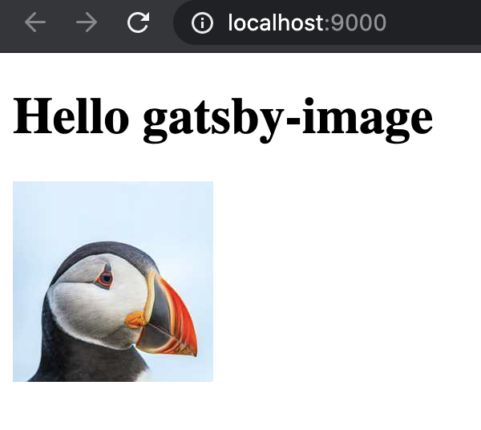

While creating this very blog I've encountered a weird error where gatsby is not building images in
production. This issue was not documented anywhere, and I couldn't find anything on it - so I've
filed [a bug report](https://github.com/gatsbyjs/gatsby/discussions/27691).

I'm also documenting it here, maybe Google will index it high enough to help somebody :)

This issue caught me by surprise, as I would imagine that the local state of the folders should not
affect production build. I tried to remove `public` folder just as a precaution (since I found a lot
of files there - and thought they were leftovers from previous builds) - but as it turned out it was
causing the bug.

## With missing ".cache" or "public" folder

I've created a minimal reproducible case in https://github.com/jakubjafra/gatsby-image-build-error
repository. After cloning it, execute:

```bash
gatsby develop # run the gatsby in development mode - so we have .cache & public folders
rm -rf ./public && gatsby build # remove one of the cache folders, and run gatsby build
gatsby serve # go to localhost:9000 - image is not loaded
```

Image URL like `http://localhost:9000/static/da9be9d13642e6487c6e7c7f3bcd1522/034c8/test.jpg`
returns 404 with HTML content inside. Folder `./public/static` contains one empty directory (but it
should contain an optimized image).

Resulting site:

<div style="width: 350px; margin: auto;">
  
</div>

This issue is present in gatsby version `2.24.90` and lower (I've tested on `2.24.85`, `2.24.89` &
`2.24.90`).

## Fix

You can fix this issue by removing both `.cache` and `public` folders while building the site:

```bash
gatsby develop # run the gatsby in development mode - so we have .cache & public folders
rm -rf ./public ./.cache && gatsby build # remove both folders, and run gatsby build
gatsby serve # go to localhost:9000 - image is loaded
```

The site is then correct:

<div style="width: 350px; margin: auto;">
  
</div>

Remember to remove both folders, I guess.
